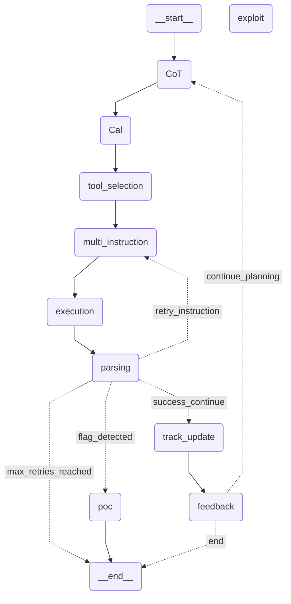

# Init Workflow - Mermaid Diagram

```mermaid
---
config:
  flowchart:
    curve: linear
---
graph TD;
	__start__(<p>__start__</p>)
	CoT(CoT)
	Cal(Cal)
	tool_selection(tool_selection)
	multi_instruction(multi_instruction)
	execution(execution)
	parsing(parsing)
	track_update(track_update)
	feedback(feedback)
	exploit(exploit)
	poc(poc)
	__end__(<p>__end__</p>)
	Cal --> tool_selection;
	CoT --> Cal;
	__start__ --> CoT;
	execution --> parsing;
	feedback -. &nbsp;continue_planning&nbsp; .-> CoT;
	feedback -. &nbsp;end&nbsp; .-> __end__;
	multi_instruction --> execution;
	parsing -. &nbsp;max_retries_reached&nbsp; .-> __end__;
	parsing -. &nbsp;retry_instruction&nbsp; .-> multi_instruction;
	parsing -. &nbsp;flag_detected&nbsp; .-> poc;
	parsing -. &nbsp;success_continue&nbsp; .-> track_update;
	tool_selection --> multi_instruction;
	track_update --> feedback;
	poc --> __end__;
	classDef default fill:#f2f0ff,line-height:1.2
	classDef first fill-opacity:0
	classDef last fill:#bfb6fc

```
