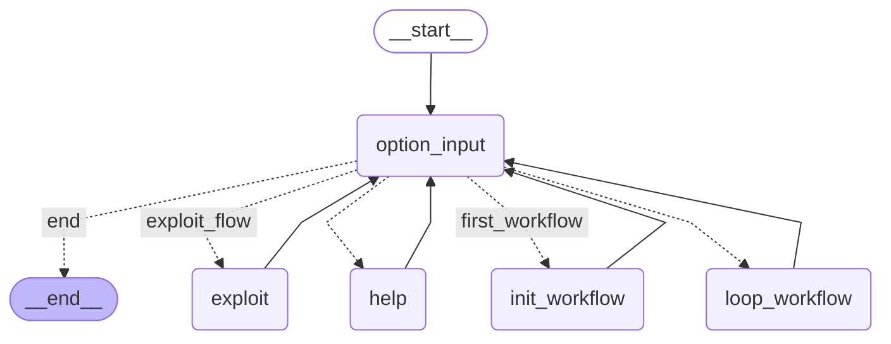

# Main Workflow - Mermaid Diagram

```mermaid
---
config:
  flowchart:
    curve: linear
---
graph TD;
	__start__([<p>__start__</p>]):::first
	init_workflow(init_workflow)
	loop_workflow(loop_workflow)
	help(help)
	option_input(option_input)
	exploit(exploit)
	__end__([<p>__end__</p>]):::last
	__start__ --> option_input;
	exploit --> option_input;
	help --> option_input;
	init_workflow --> option_input;
	loop_workflow --> option_input;
	option_input -. &nbsp;end&nbsp; .-> __end__;
	option_input -. &nbsp;exploit_flow&nbsp; .-> exploit;
	option_input -.-> help;
	option_input -. &nbsp;first_workflow&nbsp; .-> init_workflow;
	option_input -.-> loop_workflow;
	classDef default fill:#f2f0ff,line-height:1.2
	classDef first fill-opacity:0
	classDef last fill:#bfb6fc

```
